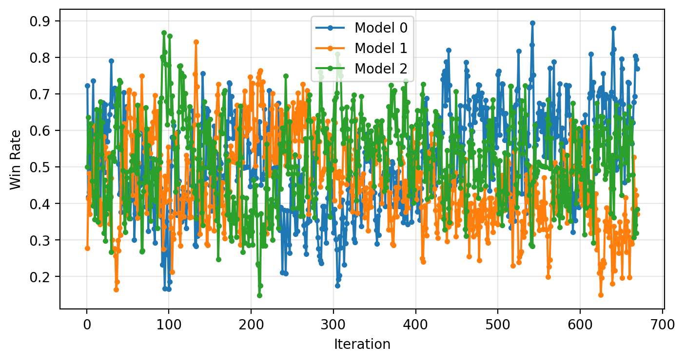

# 五子棋

## Algorithm

- MCTS 蒙特卡罗+剪枝
- CNN 神经网络

## 并行模型竞争

- 使用 `config.PARALLEL_MODELS` 个模型并行训练。
- 每 `config.COMPETITION_FREQUENCY` 次训练迭代（默认每次迭代），进行一轮竞争。
- 模型之间进行两两对局，统计胜负。
- 收集输局数据用于训练输家模型，赢家模型权重保持不变。
- 输掉70%以上对局的模型将被淘汰，并用随机初始化模型替换。
- 最佳模型的权重会被复制到主网络（索引0）用于保存和人类对弈。

### 配置常量（config.py）

- `PARALLEL_MODELS`: 并行模型数量（默认3）
- `COMPETITION_FREQUENCY`: 竞争频率（默认每10次迭代）
- `ELIMINATION_THRESHOLD`: 淘汰阈值（默认0.7，即输掉70%对局）

## Example

```bash
$ "echo" 1 | python ./main.py

1. Train AI (self-play)
2. Human vs AI
Please choose (1/2): 
Model loaded and copied to all parallel models.

--- Competition round (iteration 1) ---
    a b c d e f g h i j k l m n o 
 0  ○ ○ ● ● ● ○ ○ ● ● ○ ○ ○ ● ○ ○
 1  ○ ● ○ ○ ● ● ○ ● ● ○ ● ○ ● ● ●
 2  ○ ● ● ○ ● ● ○ ● ● ○ ● ○ ● ● ○
 3  ○ ○ ● ○ ● ● ○ ○ ○ ○ ● ● ○ ○ ●
 4  ● ○ ● ○ ○ ○ ● ○ ● ● ● ○ ○ ○ ○
 5  ● ● ● ● ○ ○ ● ○ ○ ○ ○ ● ○ ○ ●
 6  ○ ● ○ ● ○ ● ○ ● ○ ○ ○ ● ○ ● ●
 7  ● ● ● ○ ○ ● ○ ● ● ○ ● ● ● ● ○
 8  ● ○ ○ ○ ● ● ○ ● ● ● ● ○ ● ○ ●
 9  ● ● ○ ○ ○ ● ● ● ● ○ ○ ○ ○ ● ○
10  ○ ● ○ ○ ○ ○ ● ○ ● ○ ● ● ○ ● ●
11  ○ ○ ○ ● ● ○ ● ● ○ ○ ○ ○ ● ● ●
12  ○ ● ● ○ ○ ● ● ● ○ ○ ● ○ ● ○ ○
13  ○ ● ● ● ● ○ ○ ○ ○ ● ● ○ ● ● ○
14  ● ○ ● ○ ● ○ ○ ● ○ ● ● ○ ● ○ ●
Model saved to gomoku_model.pth
```

### Training

Win Rate  
  
The training for one model is not so smooth. That's why we keep the old but presently good model.
